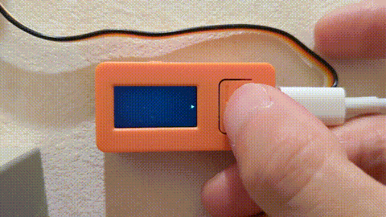
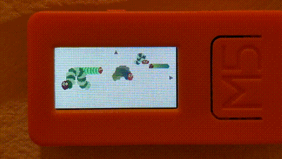
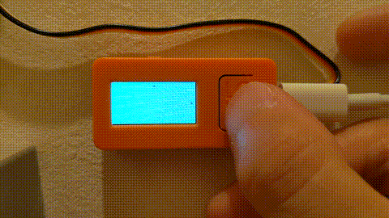
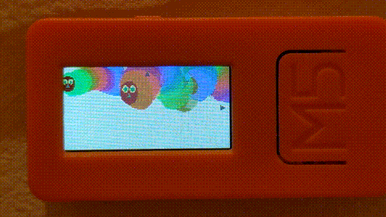

ウォシュレット後でONしとくよ
===

M5StickC + UnitIR + 赤外線制御のコンセントで作った、子供のトイレトレーニング用遅延スイッチです。

お腹がぺーこぺこー！

## 開発背景
### 課題
- 子供（2歳）がウォシュレットが怖くてトイレトレーニングが進まないのでウォシュレットを頻繁にON/OFFしたい
- ウォシュレットは電源ボタンがないことが多く、電源を切るにはコンセントを抜かないといけない
- コンセントを抜いて切るともとに戻し忘れ、設備保護が効かず汚染が進んでしまう

### アイデア
- トイレに画面とボタンを設置
- 子供がボタンを押すとウォシュレットの電源が切れ、画面に興味を引くコンテンツが流れる
- トイレ使用後自動でウォシュレットの電源を復帰する
    - 手動復帰も可能にしておく

## デモ
- [youtube](https://www.youtube.com/watch?v=YmZ89waXX18)
- ボタンを押すたびにあおむしが増える： 
- あおむしはタイマーになっていて、太くなって虹色になってから去る： 

## ハードウェア構成
- M5StickC
    - 充電器、TypeCケーブル
- IR Unit
- リモコンコンセント（オーム社 [OCR-05W](https://www.ohm-electric.co.jp/product/c23/c2313/19582/) 使用）

## 機能
- 待機画面（ウォシュレットON）
- コンテンツ（ウォシュレットOFF）：ボタン操作 (BtnA) で開始
    - あおむしが画面の中を行き来します。
        - ボタンを押すたびにあおむしが増えます。
    - （必要に応じて追加）
- 使用後自動復帰
    - 一定時間 (ON_DELAY秒) 後にONします。
    - [人感センサ](https://www.switch-science.com/catalog/5756/) などを使えばより賢くできそうです。
- 手動復帰：ボタン操作 (BtnB) 

## 課題
- 自動フタのあるトイレの場合、ボタンを押す前にフタが開いて驚いてしまうはず
    - （ボタンだけドアの隙間から外に出せば、一応NGではないかも）

## 作者
[sagiii](https://github.com/sagiii)
